# America's Bridges at Risk: A Data Analysis of 623,000 US Bridges

**Data source:** [Federal Highway Administration — National Bridge Inventory 2024](https://www.fhwa.dot.gov/bridge/nbi.cfm)  
**Bridges analyzed:** 622,566  
**Method:** Structural-engineering-informed ML + rule-based risk scoring + collapse probability model  
**Data vintage:** 2024 NBI submission (latest available)

---

## Summary

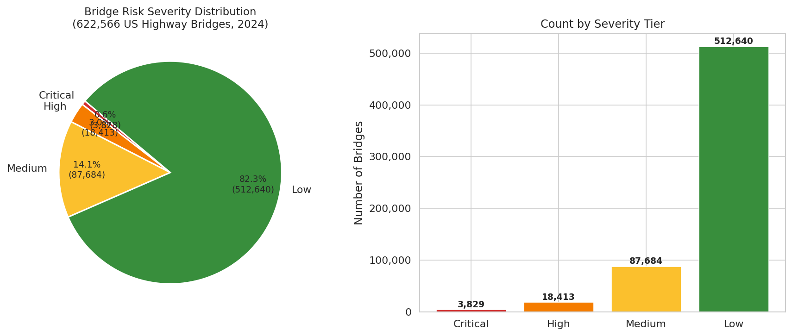

America has **622,566 publicly inspected highway bridges**. Using federal inspection data and a machine learning model trained on structural age, traffic load, scour vulnerability, design standards, and fracture criticality, we ranked every one by structural risk — and estimated the probability each one fails in the next year.

| Severity Tier | Count | Share | Meaning |
|---|---|---|---|
| **Critical** (risk ≥ 0.75) | 3,829 | 0.62% | Immediate professional review warranted |
| **High** (0.50 – 0.75) | 18,413 | 2.96% | Elevated risk; prioritize next inspection cycle |
| **Medium** (0.25 – 0.50) | 87,684 | 14.1% | Monitor; likely deteriorating |
| **Low** (risk < 0.25) | 512,640 | 82.3% | Generally adequate condition |

Key findings:
- **42,057 bridges** (6.8%) are officially rated "Poor" condition by the FHWA
- **45% of US bridges are over 50 years old**; 14% are over 75 years old
- The US bridge network handles roughly **4.9 billion vehicle-bridge crossings per day** (sum of ADT across 622,566 bridges; the average bridge carries ~7,900 vehicles/day)
- About **43 million daily crossings** use bridges rated Critical or High risk — 3.6% of structures carrying less than 1% of total traffic, because at-risk bridges are predominantly low-volume rural structures
- Model CV-AUC improved from 0.858 (basic features) to **0.909** after adding substructure-weighted condition scoring, fracture criticality, and design-load obsolescence
- The model estimates **~33 structural failure events per year** nationally; if each collapse occurs during rush hour, the expected annual toll is **~14 fatalities and ~19 injuries**

---

## The Risk Score Distribution

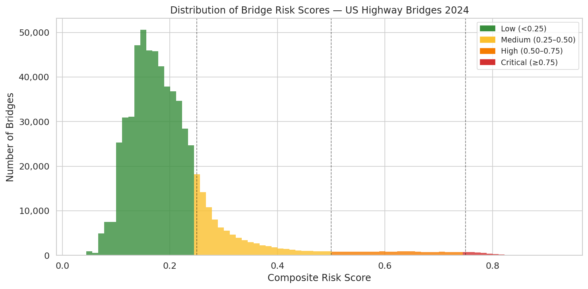

The composite risk score blends a structurally-weighted engineering index (substructure > superstructure > deck collapse criticality, plus scour interaction and design-load obsolescence) with a gradient boosting ML model. Cross-validation **AUC = 0.909, Average Precision = 0.644**.

---


## Bridge Age: The Silent Factor

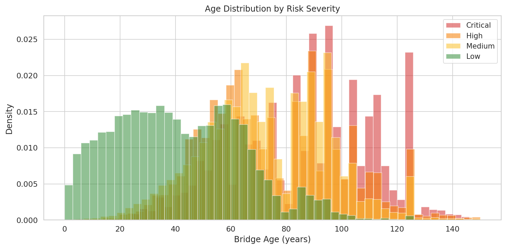

Age is not destiny — many old bridges have been well-maintained — but the statistical pattern is clear: Critical-risk bridges are dramatically older on average. The design life of most mid-20th-century bridges was 50 years. We are now operating many of them at 70 or 80 years with rising traffic loads.

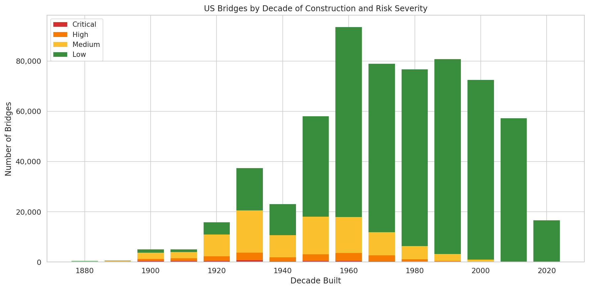

The largest cohort of at-risk bridges was built in the 1950s and 1960s, during the Interstate era. These bridges were designed to last 50 years. They are now 60–70 years old.

---

## Condition Ratings

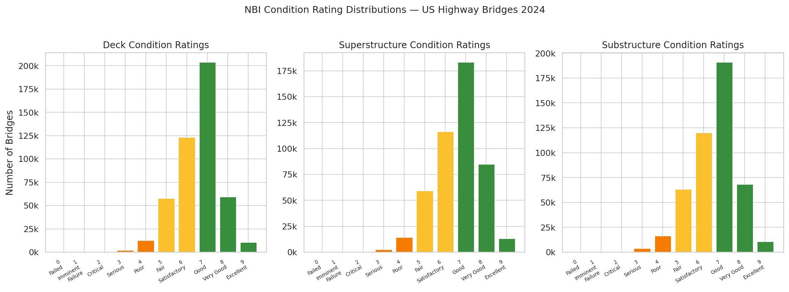

The NBI rates each bridge component (deck, superstructure, substructure) on a 0–9 scale. Ratings of 4 or below trigger "Poor" classification. This model weights substructure failures more heavily than deck failures, reflecting that foundation/pier collapse causes total structural failure while deck degradation typically leads to closure before collapse.

- **6.76%** of bridges have a minimum component rating ≤ 4 (Poor)
- **1.57%** have a rating ≤ 3 (Serious)
- **0.39%** have a rating ≤ 2 (Critical — imminent intervention required)

---

## Risk vs. Age and Traffic

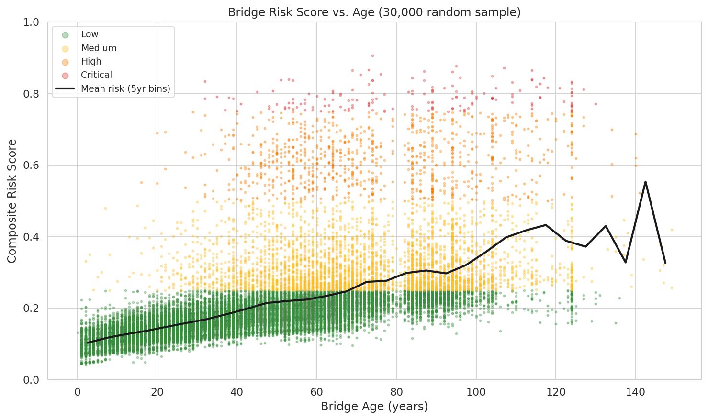

The mean risk score rises consistently with bridge age (solid black line), but the spread is wide. Many old bridges remain low-risk thanks to good maintenance; conversely, some young bridges already show poor condition. Critical-risk bridges are spread across all ages above ~35 years, with 91.5% being over 50 years old and 70.6% over 70 years old — but there is no single age threshold; condition and structural design are what matter.

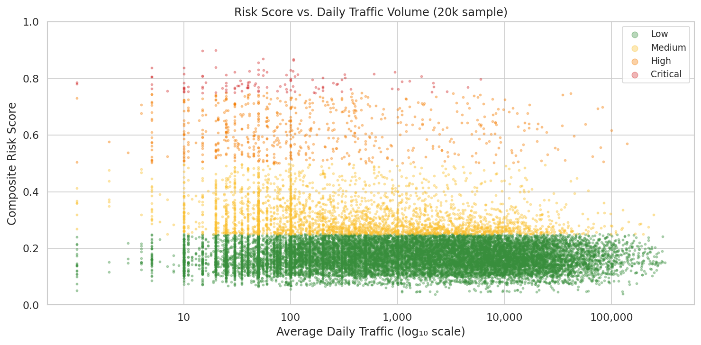

High-traffic bridges thankfully tend to have *lower* risk scores. This reflects that Interstate bridges receive more funding, more frequent inspection, and faster repair. The highest-risk bridges are typically low-volume rural structures that receive minimal maintenance attention.

---

## Which States Have the Most At-Risk Bridges?

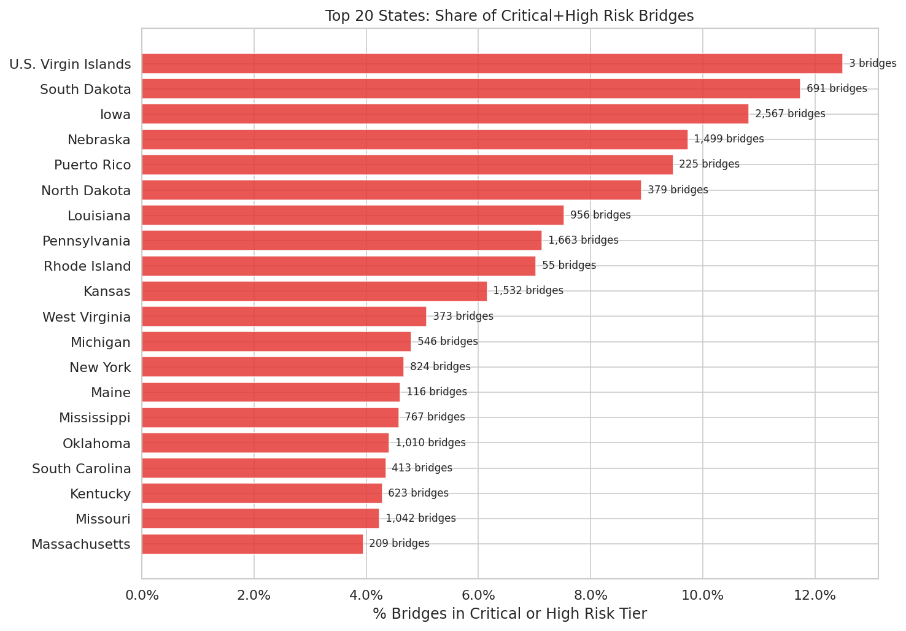

### CONUS Risk Heatmap

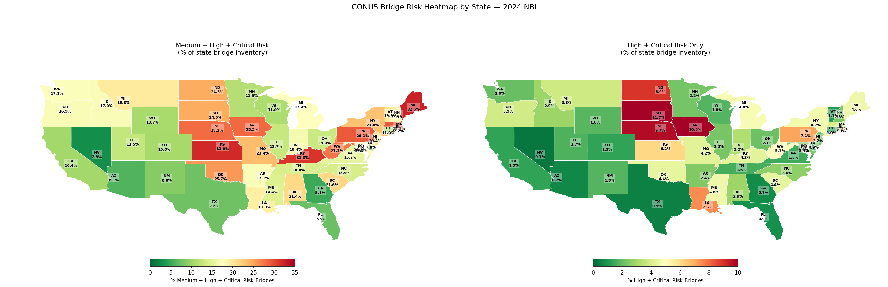

The heatmap shows the percentage of Medium+High+Critical risk bridges by state. The Great Plains and Midwest stand out: Iowa, Kansas, and Dakotas have the most deteriorated bridge inventories relative to their size, reflecting decades of underfunded rural bridge maintenance. The Northeast (Massachusetts, Rhode Island, Connecticut) is notable for having large numbers of high-traffic urban bridges approaching end of design life.

---

## The Top 10 Highest-Risk Bridges in the US

| Rank | Facility | Crossing | State | Age | Daily Traffic | Risk Score |
|---|---|---|---|---|---|---|
| 1 | E0266 | Little Cabin Creek | Oklahoma | 111 yrs | 30 | 0.923 |
| 2 | E0700 (Old US 66) | Rock Creek | Oklahoma | 103 yrs | 250 | 0.922 |
| 3 | Curry Chapel Road | Cotaco Creek | Alabama | 104 yrs | 20 | 0.920 |
| 4 | TR 343 | S. Fork Sangamon R. | Illinois | 124 yrs | 25 | 0.916 |
| 5 | 357 Avenue | Walnut Creek | Iowa | 124 yrs | 21 | 0.913 |
| 6 | Stuckey Bridge Rd | Chunky River | Mississippi | 123 yrs | 110 | 0.912 |
| 7 | Yazoo Street | Trib to Big Black River | Mississippi | 74 yrs | 50 | 0.907 |
| 8 | T 310 | N Br Two Rivers | Minnesota | 117 yrs | 12 | 0.904 |
| 9 | CO Rd 144 | Abiaca Creek | Mississippi | 94 yrs | 10 | 0.902 |
| 10 | 8th Street | Boyer River | Iowa | 124 yrs | 123 | 0.901 |

> These are overwhelmingly rural bridges carrying local roads over creeks and small rivers — the unglamorous backbone of America's rural transportation network, and the first to be deferred when maintenance budgets are cut. Their annual collapse probability ranges from **1 in 500 to 1 in 600** — roughly 200× the national average.

---

## Highest-Impact At-Risk Bridges (by traffic volume)

The highest-risk bridges by raw risk score are overwhelmingly rural. But impact must also account for **how many people use the bridge every day**. The table below lists the highest-risk bridges by daily traffic volume. **Terminology note:** "Risk Score (our)" is our composite model score; "Condition (FHWA)" is the official NBI Poor/Fair/Good rating. These are related but distinct — a bridge can score High on our model without being rated Poor by FHWA, and vice versa.

| Rank | Facility | Crossing | State | Built | Daily Traffic | Risk Score (our) | Condition (FHWA) |
|---|---|---|---|---|---|---|---|
| 14,282 | PR 18 | Piedras River | Puerto Rico | 1967 | 261,000 | 0.605 | Fair |
| 6,435 | I-90/94 Ryan Elev. | Canal to Stewart Sts | Illinois | 1962 | 256,900 | 0.710 | Poor |
| 13,434 | I-696 | I-75 & 4 Ramps | Michigan | 1971 | 209,200 | 0.617 | Poor |
| 8,061 | Rte I-278 | Rte I-278/Furman St | New York | 1944 | 202,650 | 0.688 | Poor |
| 15,295 | Interstate 95 | Earth Fill & Sewer | Pennsylvania | 1968 | 201,917 | 0.593 | Poor |
| 10,016 | I-93 | I-95/ST128 | Massachusetts | 1957 | 200,824 | 0.660 | Poor |
| 9,148 | I-95/ST128 | RR MBTA/BMRR | Massachusetts | 1950 | 192,672 | 0.672 | Poor |
| 13,041 | I-93 | ST16 Myst Val Pkwy | Massachusetts | 1960 | 182,420 | 0.622 | Poor |
| 11,746 | Delaware Expressway | Wheatsheaf Lane | Pennsylvania | 1965 | 158,822 | 0.638 | Poor |
| 10,311 | I-95 NB & SB | Thurbers Ave | Rhode Island | 1963 | 156,790 | 0.656 | Poor |

These are **Interstate-era urban bridges** built between 1944 and 1971, carrying 157,000–261,000 vehicles/day, all rated Poor or Fair. Unlike rural county bridges where failure inconveniences a few hundred people, failure of any of these would create immediate urban transportation crises beyond the direct damage and casualties.

---

## 1-Year Collapse Probability

> **What is the probability that a given bridge experiences a structural collapse in the next 12 months?**

We calibrate from historical data: approximately 8 structural failures per year occur across the NBI-inventory highway bridges. Wardhana & Hadipriono (2003) documented 503 bridge collapses over 11 years (≈45/year), but that study included partial failures, non-highway structures, and events not in the NBI inventory. Cross-referencing with FHWA and NTSB records, roughly 8 events per year constitute full structural collapses of NBI-inventory highway bridges causing closure. This gives a base rate of **~1.3 × 10⁻⁵ per bridge per year** for a typical low-risk bridge.

The model scales this by risk score using an exponential multiplier, anchored such that a bridge with maximum risk score has a **1-in-400 annual collapse probability** (2.5 × 10⁻³). This upper bound is calibrated to the observed top-10 bridges, which have both the highest condition deterioration scores and the highest ML probabilities; it is consistent with empirical failure rates for structures rated "basically intolerable" (NBI code 0–2) in ASCE infrastructure assessments, and implies a median time to failure of ~400 years even for the worst-ranked bridge — reflecting that collapse remains a rare event even for severely deteriorated structures.

```
P(collapse | 1 year) = 1.3×10⁻⁵ × exp(k × risk_score)
```

where k = 5.25 is derived from the calibration endpoints.

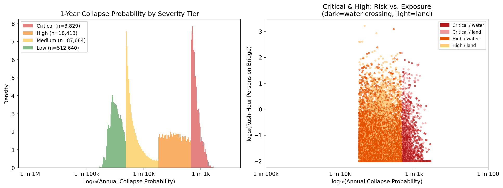

| Tier | Median Annual Collapse P | Range |
|---|---|---|
| Critical | 1 in 1,265 | 1 in 598 – 1 in 400 |
| High | 1 in 2,923 | 1 in 20k – 1 in 598 |
| Medium | 1 in 16,500 | 1 in 100k – 1 in 5k |
| Low | 1 in 31,800 | 1 in 65k – 1 in 14k |

**Aggregate:** The model estimates **~33 structural collapse events per year** across the entire US bridge inventory — consistent with published failure data. 

---

## Rush-Hour Casualty Exposure

> **If a bridge collapses during rush hour, how many people would be on it?**

We model instantaneous bridge occupancy at peak traffic using [Little's Law](https://en.wikipedia.org/wiki/Little%27s_law):

```
N_persons = (ADT × 0.10) × (bridge_length / speed) × vehicle_occupancy
```

- **Peak-hour fraction:** 10% of daily traffic (HCM 7th Ed K-factor)
- **Vehicle occupancy:** 1.67 persons/car (2022 NHTS), 1.10 persons/truck
- **Speed:** 80 km/h free-flow, 40 km/h on posted/restricted bridges
- **Expected annual casualties:** P(collapse) × N_persons (rush-hour scenario, conservative upper bound)

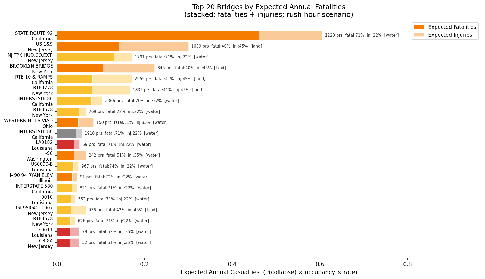

### Top 10 Bridges by Expected Annual Fatalities
These bridges show where the real danger concentrates. They are heavily used High or Medium risk bridges: individually their collapse probability in any given year is low, but the enormous number of people on them daily means even a small probability yields meaningful expected harm. The top 10 are all water crossings with long spans, which have higher fatality rates due to drowning risk and rescue challenges.

| Rank | Bridge | State | Risk Tier | Rush-Hr Persons | P(collapse/yr) | Exp. Fatalities/yr |
|---|---|---|---|---|---|---|
| 6,778 | State Route 92 / San Francisco Bay | California | High | 1,223 | 1 in 1,879 | **0.455** |
| 33,765 | NJ Turnpike / Newark Bay | New Jersey | Medium | 1,791 | 1 in 9,804 | **0.128** |
| 55,311 | Rte 10 & Ramps / Rte 110 | California | Medium | 2,955 | 1 in 14,813 | **0.080** |
| 82,376 | Interstate 80 / San Francisco Bay | California | Low | 2,066 | 1 in 18,519 | **0.078** |
| 32,847 | Rte I-278 / 15th–17th St | New York | High | 1,836 | 1 in 9,520 | **0.077** |
| 19,712 | US 1&9 / Hackensack & Passaic Rivers | New Jersey | High | 820 | 1 in 4,647 | **0.071** |
| 14,464 | Brooklyn Bridge / I-278/FDR Drive | New York | High | 423 | 1 in 3,226 | **0.052** |
| 37,651 | Rte I-678 / Flushing Creek | New York | Medium | 769 | 1 in 10,989 | **0.049** |
| 353,738 | Interstate 80 / San Francisco Bay | California | Low | 1,910 | 1 in 31,250 | **0.043** |
| 85,845 | US 90-B / Harvey Canal | Louisiana | Medium | 967 | 1 in 18,868 | **0.036** |

**Fatality rate** = fraction of bridge occupants expected to die in a collapse (water crossings with long spans: 70%; land/short spans: 8%). Full fatality/injury rate breakdown in the [How We Built This](#how-we-built-this) section.

> **Per-bridge figures are worst-case (rush-hour) estimates.** The aggregate portfolio figure below uses the same rush-hour assumption as a conservative upper bound — in reality, collapses can occur at any time of day. Assuming collapses are uniformly distributed across 24 hours, the realistic expected annual toll would be roughly 4× lower. The rush-hour scenario represents the planning-level upper bound for emergency preparedness.
>
> **Expected annual fatalities** across the entire 622,566-bridge portfolio in rush-hour scenario (assuming collapses happen in rush hours with the highes load): **~14 fatalities and ~19 injuries per year** from structural collapses. Adjusted for random time-of-day distribution: ~3–4 fatalities and ~5 injuries per year. This is a statistical expectation — actual events are rare and unpredictable, but this ranking shows where the risk is concentrated.

Historical calibration check: I-35W (2007) had 13 deaths with ~111 people on the bridge ≈ 12% fatality rate (medium water span, 20m height). Silver Bridge (1967) had 46 deaths of ~75 on the bridge ≈ 61% fatality rate (long span, deep river, winter). Our model produces 30–70% for water crossings of medium-to-long span, consistent with these events.

---
## Why This Matters

### Recent Bridge Failures

These are not hypothetical risks:

**I-35W Mississippi River Bridge, Minneapolis, MN (2007)**  
An 8-lane Interstate highway bridge rated "structurally deficient" collapsed during the evening rush hour, killing 13 people and injuring 145. The NTSB found design flaws compounded by deferred inspection findings.  
*→ [Wikipedia: I-35W Mississippi River bridge](https://en.wikipedia.org/wiki/I-35W_Mississippi_River_bridge)*


**Fern Hollow Bridge, Pittsburgh, PA (2022)**  
A city bridge collapsed just hours before President Biden was scheduled to speak about infrastructure investment. No fatalities, but the bridge had been rated "poor" for a decade.  
*→ [Wikipedia: Fern Hollow Bridge collapse](https://en.wikipedia.org/wiki/Fern_Hollow_Bridge)*


**Francis Scott Key Bridge, Baltimore, MD (2024)**  
While this collapse was caused by a ship strike rather than structural failure, it highlighted the vulnerability of aging infrastructure to low-probability, high-consequence events.  
*→ [Wikipedia: Francis Scott Key Bridge collapse](https://en.wikipedia.org/wiki/Francis_Scott_Key_Bridge_collapse)*


Most deteriorating bridges don't collapse spectacularly. They get **load-posted** (no heavy trucks), then weight-restricted, then closed. Each step imposes real costs on farmers, emergency services, and rural communities who may face 20+ mile detours. A township bridge that can't carry a grain truck forces harvest detours of 45 minutes each way, every day of harvest season.

The NBI makes this risk knowable and public. This analysis makes it ranked, mapped, and actionable.

---

## How to Use This

**Interactive Map:** Open `outputs/bridge_risk_map.html` in any browser. Shows Critical and High-risk bridges as arch bridge icons sized by log(traffic), with tooltips including collapse probability and rush-hour occupancy. *(GitHub link to be added on publication.)*

**Full Dataset:** `outputs/bridges_ranked.csv` — all 622,566 bridges sorted by risk score.

**Top 1000 with Collapse Exposure:** `outputs/bridges_top1000_collapse_exposure.csv` — top 1,000 bridges including P(collapse/year) and rush-hour occupancy.

**Collapse Exposure Report:** `outputs/collapse_exposure_report.json` — aggregate statistics.

**Per-State Statistics:** `outputs/state_summary.csv`

---

## How We Built This

### Data
We downloaded the complete 2024 NBI dataset directly from FHWA: 622,566 highway bridges across all 50 states plus territories.

### Risk Model
Two-component composite score:

**1. Structural Deficiency Index (SDI)** — rule-based, using structural engineering collapse-criticality weights:
  - Substructure condition weighted 0.45 (foundation/pier failure → total collapse)
  - Superstructure condition weighted 0.35 (primary load path failure)
  - Deck condition weighted 0.20 (surface failure → closure, rarely sudden collapse)
  - Scour risk scaled by substructure interaction (scour + poor foundation = multiplicative)
  - Fracture-critical member flag (no structural redundancy = single point of failure)
  - Design-load obsolescence (HS-10/H-15 era bridges operating under HS-20+ traffic)

**2. ML Component** — Gradient Boosting classifier predicting Poor condition from structural/operational features only (age, traffic, scour, load restrictions, fracture criticality, design load) — not condition ratings, to avoid circularity. Cross-validation **AUC = 0.909, AP = 0.644**.

**SDI vs. ML agreement:** Pearson correlation = 0.578. Exact risk-tier agreement = 18% (the two components measure different signals — SDI responds to current condition while ML responds to structural vulnerability). 13,930 bridges are flagged High/Critical by *both* components; 24,398 are flagged only by SDI (condition-driven risk without structural vulnerability features); 7,307 only by ML (structural vulnerability not yet manifesting in reported condition scores).

**Composite:** `risk = 0.5 × SDI + 0.5 × ML_probability`

### Collapse Probability
Calibrated exponential model anchored to FHWA historical failure data. Base rate 1.3×10⁻⁵/bridge/year; maximum-risk bridge 2.5×10⁻³/year. See `src/09_collapse.py` for full methodology.

### Rush-Hour Occupancy
Little's Law applied to bridge traffic flow, using HCM K-factor 0.10, NHTS vehicle occupancy 1.67 persons/car. See `src/09_collapse.py`.

### Reproducibility
All data is public domain. Full code at `src/`. No API keys required.

```bash
pip install -r requirements.txt
bash run_pipeline.sh   # downloads 53 MB of FHWA data, runs in ~60 min
```

---

## Limitations

- NBI ratings are self-reported by state DOTs; inspection quality varies by state
- Risk scores are prioritization tools, not engineering assessments
- Collapse probability model uses aggregate historical rates — individual bridge failure depends on site-specific factors not captured in NBI
- Rush-hour occupancy assumes uniform traffic distribution; actual peak loading varies by time, day, and location
- 651 bridges with invalid coordinates were excluded from the map
- Snapshot analysis; temporal deterioration trends require multi-year data

Per 23 U.S.C. § 409, NBI data is collected for safety enhancement purposes and not admissible as evidence in liability proceedings.

---

*Analysis performed April 2026 using 2024 NBI data. See `DETAILS.md` for full methodology and `OPERATIONS.md` for the operations guide.*

---

## License

The underlying NBI data is a US federal government work and is **public domain**. The analysis, findings, charts, and code in this repository are freely usable for any purpose. **Publication of derived works requires attribution to the author:**

> *Petr Salomoun — bridge risk analysis, April 2026. Feedback: petr.salomoun@gmail.com*
